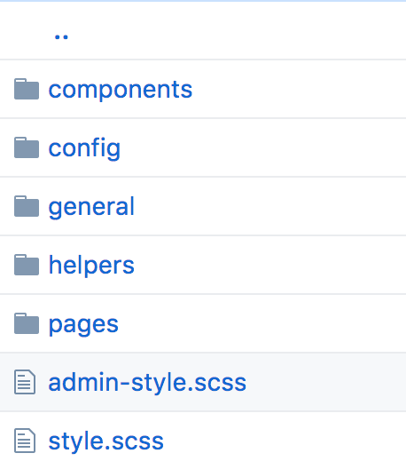

class: center, middle

# Beyond tellerand Berlin 2017

Jan Bevers


---

# Agenda

1. Conference sessions (the best off)
3. Interesting for Kunstmaan
3. SMACCS workshop
4. Discussions / questions

<iframe src="https://giphy.com/embed/WsxzPQfmXYVX2" width="480" height="251" frameBorder="0" class="giphy-embed" allowFullScreen></iframe>

---

# Conference Day 1


---

# Conference Day 2


---

# Conference

Just Kidding :)

---

# Conference (Design Center / UX designers)

## Create Cross-Culture Designs for a Global Audience

Very interesting talk about creating a brand which makes you stand out in the market. It was also about connecting with the local culture. Examples where shown from Disney in China which has integrated eastern symbols into the different disney characters.

## Life lessons from the field - [Video](https://vimeo.com/241736927)

Paula Scher talked about her career and which roles she had been doing during this career. She designed record labels, posters, interiors, wall paintings... Suggest you checkout the video!

---

# Conference (Developers)

## Styling Hillary - [Video](https://vimeo.com/241705921)

Talk about building a styleguide for the presidential campaign.

## The future of the browser - [Video](https://vimeo.com/241688643)

Nice talk about the fact that browsers need to get faster and faster.

1. More and more pixels on a device
2. Frames per seconds going up to 12Ofps
3. Solution = Make better use of CPU (render ui in parallell)
4. Challenges = Shared memory accross many processes (new language developed called Rust)
5. First version shipped in Firefox 57

---

# Conference (Designers and Developers) - Accessibility

Out with accessibility - In with inclusive design - [Video](https://vimeo.com/241688610)<br />
Exclusive Design - [Video](https://vimeo.com/241883675)

Both talks where about accessibility and improving the experience for people with a disability.

@Kunstmaan: we should always include a persona with a disability when desiging!

---

# Conference (Designers and Developers) - Design Systems

A design system is a system where UX and Development work together on building styleguides.
Mainly important when doing product development where experience should be simular accross UIs. It is also about reducing costs.

There were 2 talks about this. I like the last on `From Purpose to Patterns` best. It described the different approaches.

---

# Conference (Designers and Developers) - Design Systems

## Loose vs Strict system 

Loose means there is a very simple process, strict the opposite.<br />
Where loose can end up into a bloated system (many simular / slightly different implementations) and strict can end up in a slow development process.

## Centralised vs Distributed

Where central means dedicated people on developing the designs / libraries, distributed means it's like an internal open source system.<br />
Central has a clear responsibility, where distributed fosters more innovation as you have more different minds.

---

# Conference - Nice to know

## Crazy shit

I loved the presentation from Joshua Davis who creates animations for music (eg Super Bowl). This guy actually makes money doing crazy shit :-)

<iframe src="https://giphy.com/embed/26BRLsZRbyHCxioFO" width="350" height="350" frameBorder="0" class="giphy-embed" allowFullScreen></iframe>

---

# Conference - Nice to know

## Creative Ambition - [Video](https://vimeo.com/241841400)

In the talk it compared LinkedIn which is more focusing on people with suits (linear career evolution),<br />
with a new social network for professionals she was working on. This platform was focusing on project experiences and sharing knowledge who you worked with rather then a job title evolution. Which is more relevant these days as people change jobs more often and experience doesn't necessarely define your skills / how good you are.

Also nice was that she mentioned that neurodiversity is important (I'll show you an image on my google drive about this).

---

# Conference - Nice to know

Have a glory wall to celebrate wins! Altough the name sounds a little bit wrong :-)

There was a very cool DJ!

---

# Interesting for Kunstmaan

1. [Testing tool](http://webdriver.io/guide/services/visual-regression.html) to do a visual regression (check if everything looks the same on all browsers)
2. I saw a nice design pattern inside the Shopify management UI (where you could order page parts in a page). Which imo is way better than our current admin interface :-)
3. Design system (UX and development working together). Shared components which are easy themable.
4. Simulators for a disablity (eg Cambridge simulation gloves)
5. Caniuse command line tool (`npm i caniuse-cmd`)
6. `ResizeObserver` browser api
7. `CssJanus` to do right to left (it actually swaps all css properties, eg margin-left becomes margin-right)
8. Use css analysers ([csscss](https://github.com/zmoazeni/csscss), [Parker](https://github.com/Katiefenn/Parker), [analyze-css](https://github.com/macbre/analyze-css))
9. `window.requestIdleCallback`
10. Add type safety to CSS using [TypeStyle](https://egghead.io/lessons/css-add-type-safety-to-css-using-typestyle)

---

# SMACCS workshop

SMACCS = A framework for building scalable and modular css

## Why SMACCS


---

# SMACCS Architecture


1. Base = eg normalize.css, default styles for `body`, `h1..5`, `p`, `a`...
2. Layout = eg header, content, footer, sidebar, grid system... 
3. Module = eg button, topbar, navigation, media object, ...
4. Theme = For on the fly changes, done by users. Eg change header bg image, color theme...
5. State = Typically involves javascript code. Eg is-active, is-disabled, ... 

---

# SMACCS Example

```html 
<!DOCTYPE html>
<html lang="en">
<head>
    <title>Document</title>
</head>
<body>
    <header class="header">
        <div class="banner theme-nature">
            <!-- ... -->
        </div>
        <nav class="navigation">
            <!-- ... -->
        </nav>
    </header>
    <main class="content">
        <button class="button is-button-disabled"></button>
    </main>
</body>
</html>
```

1. Layout = `.header` and `.content`
2. Module = `.navigation`, `.banner`and `.button`
3. Theme = `.theme-nature`
4. State = `.is-button-disabled`

---

# SMACCS Conventions & Tools

Naming conventions:

1. Prefix state with `is-`
2. Prefix theme with `theme-`
3. For other parts pick a convention which suits your team best (eg BEM, camelCase, pascalCase, ...)

Tools which can help:

1. Preprocessors like SASS and LESS
2. CSS Modules / Web components (isolate css scope)

---

# SMACCS Tips & tricks

1. Use flex for grid systems
2. Look at [CSS grids](https://css-tricks.com/snippets/css/complete-guide-grid/)
3. Push back to designers when you notice too many different designs / interactions exist for the same module (eg many button styles)
4. Themes should load fast (split them into separate css files), a user should be able to change it on the fly
5. Make use of `pointer-events` css property (eg disable state)
6. Use css [custom properties (variables)](https://developer.mozilla.org/en-US/docs/Web/CSS/Using_CSS_variables) for theming
7. Try avoiding too generic names for selectors (makes refactoring very hard) eg info, component, nav
8. Prefix selectors which are from a library

---

# SMACCS Tips & tricks

Use child selectors to avoid unwanted side effects

```html
<div class="side-bar">
    <div class="links-list">
        <a href="#">Link</a>
    </div>
    <a href="#">Link</a>
</div>
```

```css
/* Bad */
.side-bar a { color: red; }
.link-list a { color: blue; }
/* Good */
.side-bar > a { color: red; }
.link-list > a { color: blue; }
```

```sass
/* Order is important, imagine somebody chaging this */ 
@import 'side-bar';
@import 'link-list';
```
---

# SMACCS vs Kunstmaan Bundles



1. Base = General
2. Modules and Layout mixed = Components/Pages
3. Themes = We make use of SASS variables (eg colors..)
4. State = BEM (modifier)

---

# Discussions / Questions

Still awake?

<iframe src="https://giphy.com/embed/BtMgDj2mZLzws" width="480" height="251" frameBorder="0" class="giphy-embed" allowFullScreen></iframe>
